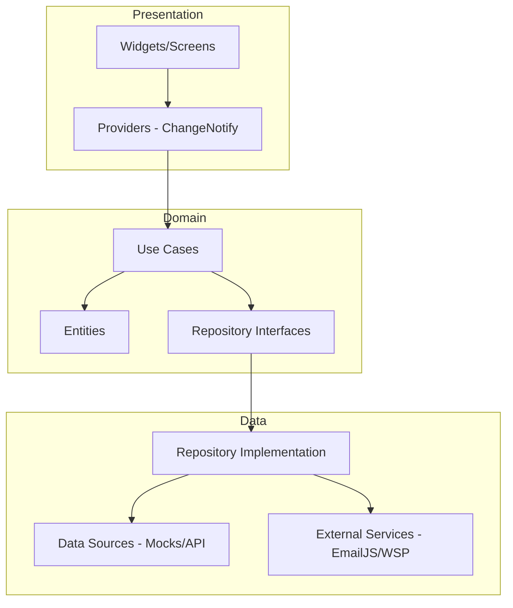

# FinanTech BTG 🏦 - Sistema de Gestión de Fondos (FPV/FIC)

FinanTech es una aplicación de alta fidelidad desarrollada en Flutter para la gestión de fondos de inversión (FPV/FIC). El proyecto fue diseñado bajo los más altos estándares de ingeniería de software, utilizando **Clean Architecture**, **Navigator 2.0** y un sistema de notificaciones multicanal real.


---

## 🏗️ Arquitectura del Proyecto

La aplicación sigue los principios de **Clean Architecture**, dividiendo la lógica en capas independientes para garantizar testeabilidad y escalabilidad:

### Diagrama de Capas


*   **Domain Layer:** Contiene la lógica de negocio pura (Entities y Use Cases) libre de dependencias externas.
*   **Data Layer:** Implementa los repositorios y gestiona la comunicación con servicios externos y APIs simuladas.
*   **Presentation Layer:** Manejo de estado con **Provider** y una UI reactiva diseñada con componentes reutilizables.

---

## 🚀 Funcionalidades Principales

1.  **Dashboard Premium:** Visualización de saldo disponible ($500.000 COP inicial) y fondos.
2.  **Suscripción Inteligente:** Validación de montos mínimos según el fondo seleccionado.
3.  **Cancelación con Reembolso:** Retiro de fondos con actualización automática del saldo global.
4.  **Historial de Transacciones:** Registro detallado de cada movimiento con filtros por tipo.
5.  **Notificaciones Multicanal Reales:**
    *   📧 **Email Real:** Integración con **EmailJS** para envío de correos electrónicos profesionales.
    *   🟢 **WhatsApp:** Apertura automática de chat con mensaje pre-formateado (External App Launcher).
    *   📱 **SMS:** Integración con **TextBelt** (Simulado/Real según disponibilidad regional).

---

## 🛠️ Tecnologías y Patrones

*   **State Management:** Provider.
*   **Routing:** GoRouter (Navigator 2.0) con `StatefulShellRoute` para persistencia de estados en pestañas.
*   **Inyección de Dependencias:** GetIt.
*   **UI/UX:** Dark Mode, Glassmorphism, micro-animaciones (Overlay de éxito).
*   **Dependency Management:** http, url_launcher, intl, mocktail.

---

## 🧪 Pruebas Unitarias (Unit Testing)

Se implementó una suite de pruebas unitarias para garantizar la estabilidad del núcleo del sistema:

*   **Use Cases:** Pruebas de suscripción (éxito, saldo insuficiente, errores de repo).
*   **Providers:** Pruebas de estado inicial, carga de datos y flujo de información.

**Comando para ejecutar pruebas:**
```bash
flutter test
```

---

## 📡 API Simulada y Servicios

La aplicación consume datos de una **API simulada** (`MockFundDataSource`) que emula latencia de red real para probar los `Loading States`.

### Fondos Disponibles (BTG List)
| ID  | Nombre                      | Monto Mínimo | Categoría |
| --- | --------------------------- | ------------ | --------- |
| 1   | FPV_BTG_PACTUAL_RECAUDADORA | $75.000      | FPV       |
| 2   | FPV_BTG_PACTUAL_ECOPETROL   | $125.000     | FPV       |
| 3   | DEUDAPRIVADA                | $50.000      | FIC       |
| 4   | FDO-ACCIONES                | $250.000     | FIC       |
| 5   | FPV_BTG_PACTUAL_DINAMICA    | $100.000     | FPV       |

---

## ⚙️ Instrucciones de Ejecución

1.  **Clonar el repositorio:**
    ```bash
    git clone [URL_DEL_REPOSITORIO]
    ```
2.  **Instalar dependencias:**
    ```bash
    flutter pub get
    ```
3.  **Configurar Android (Permisos):**
    El archivo `AndroidManifest.xml` ya cuenta con los permisos de `<queries>` para abrir WhatsApp y URLs externas.
4.  **Ejecutar la app:**
    ```bash
    flutter run
    ```

---

## 📝 Notas del Desarrollador
*   El sistema de **Email** está configurado y activo.
*   El sistema de **WhatsApp** requiere que el dispositivo tenga instalada la aplicación para abrir el enlace profundo.
*   El sistema de **SMS** utiliza una llave gratuita de TextBelt (limitada a 1 mensaje diario por IP/País). En caso de error regional, el sistema muestra un mensaje amigable al usuario.

---

